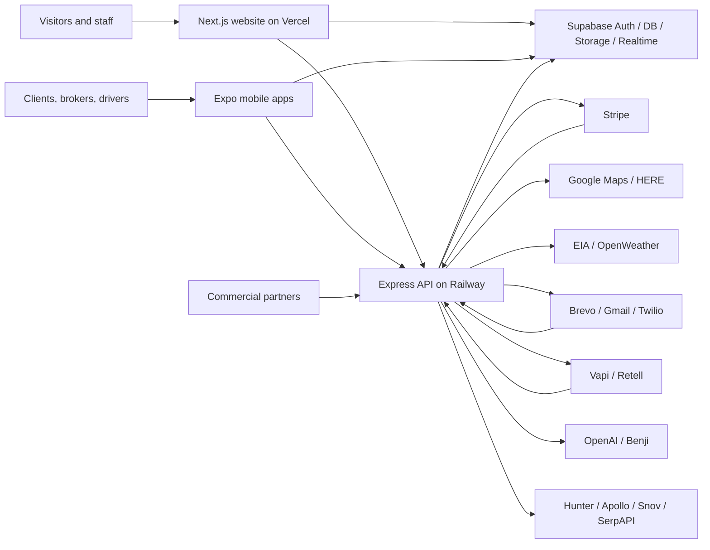

# DriveDrop Company and Technical Handover

> **Authoritative repository guide**
> **Last code verification:** 2026-08-25
> **Document owner after handover:** `[NAME / ROLE]`
> **Business owner:** `[CEO / OWNER NAME]`
> **Production website:** <https://www.drivedrop.us.com>
> **Confidential credentials:** Never put passwords, recovery codes, private keys, or service-role keys in this file. Store them in the company password manager and record only ownership below.

This is the primary handover for DriveDrop. It is written for executives, operations staff, support staff, and engineers. Runtime code, deployment consoles, and database state take precedence if they disagree with this document. Update this file in the same pull request as any material system or operating-process change.

## Contents

- [Read This First](#read-this-first)
- [Executive Summary](#executive-summary)
- [Company Knowledge to Complete](#company-knowledge-to-complete)
- [Product and Users](#product-and-users)
- [System Architecture](#system-architecture)
- [Repository Map](#repository-map)
- [Roles and Access](#roles-and-access)
- [Core Business Workflows](#core-business-workflows)
- [Website](#website)
- [Mobile Application](#mobile-application)
- [Backend API](#backend-api)
- [Database and Storage](#database-and-storage)
- [Benji and AI](#benji-and-ai)
- [External Services](#external-services)
- [Configuration and Secrets](#configuration-and-secrets)
- [Local Development](#local-development)
- [Testing and Quality](#testing-and-quality)
- [Deployment and Release](#deployment-and-release)
- [Operations Runbooks](#operations-runbooks)
- [Security Privacy and Compliance](#security-privacy-and-compliance)
- [Monitoring and Incident Response](#monitoring-and-incident-response)
- [Backup and Disaster Recovery](#backup-and-disaster-recovery)
- [Costs Contracts and Ownership](#costs-contracts-and-ownership)
- [Known Risks and Open Decisions](#known-risks-and-open-decisions)
- [Successor Onboarding](#successor-onboarding)
- [Departure Checklist](#departure-checklist)
- [Glossary](#glossary)
- [Documentation Rules](#documentation-rules)

## Read This First

1. Obtain company-managed access to GitHub, Supabase, Railway, Vercel, Expo/EAS, Apple Developer, Google Play Console, Stripe, the domain registrar, DNS, and the password manager.
2. Verify production from the vendor consoles. A green GitHub workflow does **not** mean production deployed; the current GitHub deploy job only prints placeholder messages.
3. Never paste credentials into tickets, chat, this README, or committed `.env` files. Use the password manager and each platform's encrypted environment settings.
4. Do not run old root-level SQL files against production without reviewing the migration history and taking a backup. The repository contains historical and one-off SQL in addition to formal migrations.
5. Confirm the current production schema before changing it. The initial schema, later migrations, and application expectations have drifted over time.
6. Treat pricing, payment, identity, driver approval, webhook, and AI-action changes as high risk. Test them in a non-production environment first.
7. Fill every `[FILL BEFORE DEPARTURE]` item in this guide or assign an owner who can obtain it.

### Sources of truth

| Subject | Authoritative source |
|---|---|
| Product behavior | Deployed app, then current source code |
| Database structure | Production Supabase schema and applied migration ledger |
| Secrets | Company password manager and vendor environment consoles |
| Backend deployment | Railway project settings and deployment logs |
| Website deployment | Vercel project settings and deployment logs |
| Mobile releases | EAS, Apple App Store Connect, and Google Play Console |
| Payments and refunds | Stripe dashboard and webhook event history |
| User identity | Supabase Auth plus the `profiles` table |
| Domain and email | Registrar, DNS provider, Google Workspace/Gmail, and Brevo |
| Business policy | Signed contracts and CEO-approved written policy |

## Executive Summary

DriveDrop is a vehicle-shipping platform connecting clients and brokers who need vehicles moved with approved drivers/carriers and internal administrators who oversee fulfillment. The product includes:

- A public and authenticated Next.js website.
- An Expo/React Native mobile application for role-specific workflows.
- An Express/TypeScript API hosted on Railway.
- Supabase for authentication, PostgreSQL/PostGIS data, realtime features, and object storage.
- Stripe for payments and financial events.
- Mapping, routing, fuel, and weather providers for route and pricing evidence.
- Email, SMS, campaigns, and voice-agent integrations.
- Benji AI orchestration for supported administrative and operational assistance.

The system is not a single monolith. Production depends on multiple independently managed vendor accounts, environment variables, webhook registrations, DNS records, mobile signing identities, and database policies. Ownership transfer is therefore as important as source-code transfer.

### Business continuity priorities

1. Keep Supabase, Railway, Vercel, Stripe, DNS, and email billing active.
2. Preserve access to the GitHub organization and production vendor accounts with at least two company-controlled administrators.
3. Reconcile active shipments and payment state before any production maintenance.
4. Keep Stripe, Brevo, Gmail, Vapi/Retell, and integration webhooks pointed at the current production API.
5. Rotate credentials previously known by departing personnel and verify all clients afterward.
6. Maintain a tested database recovery procedure.

## Company Knowledge to Complete

The repository cannot establish the following company facts. The departing owner and CEO must complete them.

| Item | Value | Accountable owner |
|---|---|---|
| Legal company name and jurisdiction | `[FILL BEFORE DEPARTURE]` | `[NAME]` |
| Registered business address | `[FILL BEFORE DEPARTURE]` | `[NAME]` |
| EIN/tax records location | `[PASSWORD-MANAGER OR DRIVE LINK]` | `[NAME]` |
| Insurance policies and renewal dates | `[FILL BEFORE DEPARTURE]` | `[NAME]` |
| Carrier/broker authority and identifiers | `[MC/DOT/OTHER OR N/A]` | `[NAME]` |
| Primary executive escalation contact | `[NAME / PHONE / EMAIL]` | CEO |
| Operations escalation contact | `[NAME / PHONE / EMAIL]` | `[NAME]` |
| Technical escalation contact | `[NAME / PHONE / EMAIL]` | `[NAME]` |
| Finance/refund approval contact | `[NAME / PHONE / EMAIL]` | `[NAME]` |
| Privacy and legal contact | `[NAME / PHONE / EMAIL]` | `[NAME]` |
| Standard support hours and SLA | `[FILL BEFORE DEPARTURE]` | `[NAME]` |
| Pricing approval policy | `[LINK OR SUMMARY]` | `[NAME]` |
| Cancellation/refund policy | `[LINK OR SUMMARY]` | `[NAME]` |
| Driver vetting policy | `[LINK OR SUMMARY]` | `[NAME]` |
| Incident communications policy | `[LINK OR SUMMARY]` | `[NAME]` |
| Customer contracts/templates location | `[SECURE DRIVE LINK]` | `[NAME]` |
| Vendor contracts and renewal calendar | `[SECURE DRIVE LINK]` | `[NAME]` |
| Accounting/bookkeeping system | `[SYSTEM / OWNER]` | `[NAME]` |
| Bank/payout account ownership | `[OWNER ONLY; NO NUMBERS]` | `[NAME]` |

## Product and Users

### User groups

- **Visitor:** Views public marketing, service, legal, and quote-entry pages.
- **Client:** Requests and pays for vehicle shipments; tracks status; exchanges shipment messages and documents.
- **Driver:** Applies, supplies identity/vehicle evidence, receives assignments, performs pickup/delivery workflows, and receives payouts where enabled.
- **Broker:** Uses broker-specific shipment, application, and payout workflows introduced by later schema and UI changes.
- **Administrator:** Reviews applications, manages shipments and assignments, controls pricing/operations, monitors outreach and integrations, and accesses supported Benji tooling.
- **Commercial/integration client:** Uses bulk, BOL, webhook, API, or SFTP functionality when corresponding feature flags and account configuration are enabled.

### Product boundaries

DriveDrop coordinates shipment creation, pricing, assignment, status evidence, communications, and payment-related actions. It does not make external providers infallible. Route estimates, fuel/weather observations, AI output, and third-party carrier data must be treated as evidence or assistance, not unquestionable truth.

## System Architecture



### Request flow

1. Supabase authenticates a user and issues an access token.
2. Website/mobile sends that bearer token to protected API routes.
3. Backend `authenticate` validates it using `supabase.auth.getUser`, loads the matching `profiles` row, and attaches identity/role information.
4. Route-level `authorize(...)` middleware limits selected endpoints by role.
5. Services read/write Supabase, invoke vendors, and return normalized responses.
6. Webhooks independently update payment, email, integration, or voice state and must be authenticated by provider-specific mechanisms.

### Runtime startup effects

The backend entry point loads configuration, registers Benji tools/events, mounts health and API routes, preserves raw request bodies for Stripe webhook verification, starts confirmation cleanup, and registers SMS notification listeners. Startup changes can therefore affect more than HTTP routing.

## Repository Map

| Path | Purpose |
|---|---|
| `backend/` | Express API, services, middleware, Benji, jobs/listeners, scripts, and tests |
| `website/` | Next.js App Router website, dashboards, server/client integrations, public assets, and tests |
| `mobile/` | Expo/React Native app, native projects, screens, navigation, services, and assets |
| `supabase/` | Formal Supabase migrations and related project assets |
| `.github/workflows/` | GitHub validation workflow; current deployment steps are placeholders |
| `railway.toml` | Railway backend build/deploy entry point |
| Root `*.sql` | Historical setup, diagnostics, repair, and one-off scripts; review before use |
| Root `README.md` | This handover and the only general project-status document |

Generated outputs such as `.next/`, `dist/`, Expo exports, dependency directories, temporary reports, and local `.env` files must remain untracked.

## Roles and Access

### Application authorization

The backend recognizes `client`, `driver`, and `admin` roles in its main middleware; later features also introduce broker behavior. Supabase RLS and route middleware jointly determine access. Never rely only on hidden UI controls.

**Important current risk:** universal `is_verified` enforcement is commented out in `backend/src/middlewares/auth.middleware.ts`. Individual routes may enforce checks, but authentication alone does not guarantee that a profile or driver was approved. Resolve this policy explicitly before assuming verification is enforced.

### Access-control review checklist

- Confirm every sensitive route uses authentication and appropriate role authorization.
- Confirm Supabase RLS is enabled and tested for every exposed table.
- Use service-role credentials only in trusted server code.
- Test client, driver, broker, admin, expired-token, and unverified-user cases.
- Review object-storage bucket policies separately from table RLS.
- Remove former staff from GitHub, cloud vendors, domain/DNS, app stores, email, and payment systems.

## Core Business Workflows

### Signup and login

1. User creates or enters credentials through website/mobile.
2. Supabase Auth establishes identity.
3. A `profiles` row supplies application role and profile state.
4. Clients preserve sessions using Supabase-supported storage/cookie behavior.
5. Protected API calls send a bearer token; backend resolves the current profile.

Operational checks: confirm email/phone verification behavior, profile creation trigger health, redirect URLs, cookie domain/security, and role assignment. Never assign admin status based only on client-supplied data.

### Client shipment lifecycle

1. Client enters origin, destination, vehicle, timing, and contact details.
2. Pricing combines configured rules with route/evidence sources as available.
3. A shipment is created and associated with the authenticated owner.
4. Payment intent/checkout state is created through Stripe where required.
5. Admin reviews and assigns a driver/carrier.
6. Driver records pickup evidence and status updates.
7. Client/admin tracks progress and communicates through shipment messaging.
8. Driver records delivery evidence; shipment and payment/payout state are reconciled.

At each transition, verify authorization, allowed previous status, timestamps, audit evidence, notifications, and payment consequences.

### Broker workflow

Broker functionality was added after the initial schema and includes dedicated UI, application/change-request, shipment, and payout concerns. Before operating it, verify the production `broker_*` tables, role representation, RLS policies, and enabled routes. Broker payout changes are financially sensitive and require dual review.

### Driver onboarding and approval

1. Applicant submits profile, identity/license, vehicle, insurance, and requested evidence.
2. Files are uploaded to controlled storage paths.
3. Admin reviews the application and supporting records.
4. Approval/rejection changes application/profile state.
5. Only approved drivers should receive operational assignments under company policy.

The database includes `driver_applications` and `vehicle_photos`; later migrations add related controls. The actual required documents and rejection/appeal rules must be supplied in [Company Knowledge to Complete](#company-knowledge-to-complete).

### Assignment pickup and delivery

- Assignment must be authorized and bound to the correct driver and shipment.
- Pickup should capture time, location/status, photos/inspection, and BOL where enabled.
- Delivery should capture time, recipient/evidence, final photos/inspection, and completion state.
- Tracking events are append-oriented operational evidence; avoid silently rewriting history.
- Failure, cancellation, reassignment, damage, and dispute paths need human escalation.

### Payments refunds and payouts

Stripe is the financial source of truth for card events. Application payment rows must reconcile to Stripe object IDs and webhook events.

- Verify webhook signatures using `STRIPE_WEBHOOK_SECRET` and preserve raw request bodies.
- Make handlers idempotent because Stripe retries events.
- Never mark a shipment paid from a browser redirect alone.
- Record refund reason, approver, amount, Stripe ID, and customer communication.
- Confirm driver payout eligibility from delivered/accepted state and company policy.
- Reconcile failed, disputed, partially refunded, and duplicated events manually.

### Cancellation

Before cancelling, identify shipment state, driver assignment, captured payment, refund eligibility, incurred costs, and notification obligations. Do not use a single status update as a substitute for Stripe/refund and assignment reconciliation.

### Messaging and notifications

Messages and notifications can involve Supabase realtime, email, and SMS listeners. Confirm participants are authorized for the shipment, redact sensitive information, and avoid treating delivery-provider acceptance as proof a person read the message.

### Pricing and route evidence

Google Maps and HERE support geocoding/routing; EIA supports diesel data; OpenWeather can add route-point observations. OPIS remains disabled unless the company has a licensed feed contract. Pricing must fail conservatively when evidence is missing, stale, or contradictory. AI must not invent costs, routes, or profit.

### Campaigns and outreach

Campaign tooling can discover/enrich contacts and send through Brevo/Gmail. Honor consent, unsubscribe, suppression, warmup, and daily limits. Keep `OUTREACH_WARMUP=true` until the owner intentionally approves sending. Brevo webhook and Gmail OAuth credentials are separate systems.

### Commercial integrations

Commercial functionality may include accounts, bulk upload, APIs, BOL, gate passes, outbound webhooks, SFTP, and incoming partner webhooks. Most are disabled by default. Enable only after contract, credentials, schema, RLS, replay/idempotency, and support ownership are confirmed.

## Website

The website uses Next.js 14 App Router, React 18, TypeScript, Tailwind, Radix UI, Supabase, Stripe, React Hook Form, Zod, Recharts, and locally licensed Streamline icons.

### Route families

The repository currently contains more than 100 `page.tsx` routes. Treat the filesystem under `website/src/app/` as the exact route inventory. Major families include:

- Public home, services, company/about, contact, pricing/quote, and legal pages.
- Authentication and account recovery.
- Client account, shipment, tracking, payment, and messaging pages.
- Driver onboarding/profile/application and operational pages.
- Broker application/dashboard/shipment/payout pages.
- Admin dashboards for shipments, drivers, users, pricing, maps, analytics, communications, outreach, campaigns, integrations, and AI tooling.

### UI assets and icons

- Canonical Streamline metadata: `website/src/components/icons/streamline-manifest.ts`.
- Renderer: `website/src/components/icons/StreamlineIcon.tsx`.
- Lucide-compatible adapter: `website/src/components/icons/streamline-lucide.tsx`.
- Licensed SVG assets: `website/public/icons/streamline/`.
- The project currently uses 76 mapped icons with a 100-icon license guard. Do not bypass that guard or redistribute the assets outside the licensed project.
- The carrier hero at `website/public/images/vehicle-carrier-highway.jpg` has visible plates permanently mosaicked. Review all future vehicle photography for plate, DOT, carrier-brand, face, and location privacy.

### Website environment

No tracked website `.env.example` currently exists. Create one when configuration is normalized. Public values generally include Supabase URL/anon key, backend URL, Google Maps browser key, and Stripe publishable key. Server-only route handlers may also reference private email/payment configuration. Audit `process.env` references before each production setup.

Public-prefixed values are embedded into browser bundles and are not secrets. Restrict them by domain/API/platform in the provider console.

## Mobile Application

The mobile app uses Expo SDK 53, React 19, React Native 0.79.5, React Navigation, Supabase, Stripe React Native, Sentry, maps/location, camera, document/image tools, notifications, and secure storage.

### Version state

- `mobile/app.json` app version: `1.7.0`.
- `mobile/package.json` package version: `1.6.0`.
- Expo Android `versionCode`: `10`.
- Checked-in native Android Gradle values differ (`versionName 1.2.0`, `versionCode 4`), so determine whether EAS/prebuild or checked-in native settings are authoritative before release.
- `extra.eas.projectId` is still `your-project-id` and must be replaced with the real company-owned EAS project ID.

### Build profiles

- `development`: internal development client.
- `preview`: internal distribution on the preview channel.
- `production`: production channel, Android app bundle, remote versioning/auto-increment.

### Mobile map key

The checked-in Android manifest uses a `GOOGLE_MAPS_API_KEY` manifest placeholder. Gradle sources it from `EXPO_PUBLIC_GOOGLE_MAPS_API_KEY` at build time. EAS/local build environments must define this value. Restrict the Android key by package name and signing certificate; use a separately restricted iOS key if iOS maps require one.

### Release process

1. Reconcile versions and changelog.
2. Install dependencies and pass type-check/lint.
3. Test on physical Android and iOS devices, including auth, background/resume, camera, uploads, location, maps, notifications, Stripe, and poor connectivity.
4. Confirm EAS project ownership, environment variables, signing credentials, bundle/package identifiers, store listings, privacy declarations, and support URLs.
5. Build with `eas build --platform android --profile production` and/or the iOS equivalent.
6. Test the resulting store artifact before staged rollout.
7. Submit through EAS or app-store consoles, monitor crash reporting, and retain rollback/previous-version information.

## Backend API

The backend uses Node.js, Express 5, TypeScript, Supabase, Stripe, OpenAI, Brevo, Twilio, Google Maps, HERE, EIA, OpenWeather, Vapi/Retell, and outreach/integration providers.

### Endpoints and route modules

Health endpoints are available at `/health` and `/api/health`; business routes are mounted under the configured API prefix. The route registry in `backend/src/routes/index.ts` is authoritative.

| Area | Responsibility |
|---|---|
| auth, users | Identity-adjacent API and profiles |
| shipments | Shipment creation, state, evidence, and role workflows |
| payments | Stripe intents, financial state, refunds/payout concerns |
| applications, drivers | Driver application, approval, profile, and assignment data |
| messages, notifications, SMS, email | User and operational communications |
| maps, route optimization | Geocoding, routes, matrices, and optimization |
| pricing, intelligence | Quotes and supporting market/route evidence |
| admin, diagnostics, analytics | Restricted operational visibility and controls |
| commercial, integrations, uploads | Partner accounts, files, bulk/API/SFTP/webhook workflows |
| BOL | Bill of lading generation/management |
| AI, Benji V2, Benji V3 | AI endpoints and orchestration |
| leads, outreach, campaigns, carriers | Prospecting and campaign operations |
| Quick Send | Isolated Gmail OAuth/send flow |
| Vapi, Retell | Voice-agent setup and webhook processing |
| webhooks/email webhooks | Provider callbacks; validate signatures/tokens and idempotency |

There are dozens of route modules and hundreds of route declarations. Generate an endpoint inventory from source when changing public contracts; do not maintain a stale hand-written list here.

### Feature flags

All flags below are disabled unless the environment value is exactly `true`:

| Variable | Capability |
|---|---|
| `ENABLE_COMMERCIAL` | Commercial accounts |
| `ENABLE_AI_DISPATCHER` | AI dispatch assistance |
| `ENABLE_NATURAL_LANGUAGE` | Natural-language shipment creation |
| `ENABLE_INTEGRATIONS` | Universal integrations |
| `ENABLE_BULK_V2` | Enhanced bulk upload |
| `ENABLE_BOL` | Bill of lading system |
| `ENABLE_GATE_PASS` | Gate passes |
| `ENABLE_AI_EXTRACTION` | AI document extraction |
| `ENABLE_COMMERCIAL_API` | Commercial REST API |
| `ENABLE_WEBHOOKS` | Outbound webhook system |
| `ENABLE_BENJI_QA_CONSOLE` | Admin QA console; never enable in customer production |

## Database and Storage

Supabase PostgreSQL with PostGIS, Auth, RLS, Realtime, and Storage is the shared data platform. More than 100 SQL/migration assets exist across the repository.

### Core data domains

The original schema includes `profiles`, `driver_applications`, `vehicle_photos`, `shipments`, `tracking_events`, `messages`, and `payments`. Later migrations add or extend:

- Broker and commercial accounts/workflows.
- Driver/carrier operations and assignment data.
- Pricing intelligence and route evidence.
- BOL, gate-pass, integration, API, and webhook data.
- Campaign, lead, carrier outreach, email-event, and Quick Send data.
- Parking-interest data.
- Benji events, traces, trace steps, usage, policy violations, confirmations, memories, and sessions.
- Storage buckets and policies for operational documents/images.

### Migration procedure

1. Identify production project and latest applied migration in Supabase.
2. Take a verified backup or point-in-time recovery checkpoint.
3. Review SQL for destructive operations, lock duration, RLS/policy changes, defaults, backfills, and rollback feasibility.
4. Apply to staging and test all affected roles.
5. Apply through the team-approved Supabase migration process, not by casually pasting root SQL.
6. Verify schema, policies, indexes, triggers, storage policies, and representative workflows.
7. Record operator, timestamp, migration, result, and rollback notes.

### RLS and service role

Client applications use the Supabase anon key plus user sessions; RLS must constrain access. Backend service-role usage bypasses RLS and is therefore highly sensitive. Never ship `SUPABASE_SERVICE_ROLE_KEY` to website browser code or mobile bundles.

### Production inventory to capture

- Supabase organization/project ID and region: `[FILL BEFORE DEPARTURE]`
- Database size and growth: `[FILL BEFORE DEPARTURE]`
- Enabled extensions: `[VERIFY IN CONSOLE]`
- Storage bucket names/policies: `[VERIFY IN CONSOLE]`
- Backup/PITR tier and retention: `[FILL BEFORE DEPARTURE]`
- Realtime publications: `[VERIFY IN CONSOLE]`
- Scheduled jobs/Edge Functions: `[VERIFY IN CONSOLE]`
- Applied migration baseline: `[FILL BEFORE DEPARTURE]`

## Benji and AI

Benji V2 lives under `backend/src/benji/`; a parallel V3 implementation exists under `backend/src/benji-v3/`. The system includes orchestration, tool registration, events/traces, policy controls, confirmations, memory/session data, usage records, and violation logging.

### AI operating rules

- AI output is untrusted until validated.
- Require explicit confirmation for consequential actions.
- Never allow AI to invent prices, profit, identity status, payment state, route evidence, or legal conclusions.
- Validate tool arguments, role authorization, resource ownership, and current state server-side.
- Keep usage/cost limits and audit traces enabled.
- Redact secrets and unnecessary personal data from prompts and logs.
- `ENABLE_BENJI_QA_CONSOLE` must remain off in customer production.
- Review both V2 and V3 before changing shared behavior; parallel implementations create drift risk.

## External Services

| Service | Purpose | Key configuration | Console owner |
|---|---|---|---|
| GitHub | Source and CI | repository, environments, branch rules | `[NAME]` |
| Supabase | Auth, DB, storage, realtime | URL, anon/service keys, JWT, policies | `[NAME]` |
| Railway | Backend hosting | production variables, domain, logs | `[NAME]` |
| Vercel | Website hosting | project, domain, variables | `[NAME]` |
| Expo/EAS | Mobile builds/updates | project ID, credentials, channels | `[NAME]` |
| Apple Developer/App Store Connect | iOS signing/distribution | team, certificates, listing | `[NAME]` |
| Google Play Console | Android distribution | app, signing, listing | `[NAME]` |
| Stripe | Payments/refunds/webhooks | secret/publishable keys, webhook secret | `[NAME]` |
| Google Maps/Cloud | Maps, places, geocoding | platform-restricted keys | `[NAME]` |
| HERE | Truck routing/matrices | server API key | `[NAME]` |
| EIA | Diesel evidence | API key | `[NAME]` |
| OpenWeather | Route weather evidence | API key | `[NAME]` |
| OPIS | Licensed fuel feed | contract/product; currently disabled | `[NAME]` |
| Brevo | Transactional/outreach email | API key, sender/domain, webhook token | `[NAME]` |
| Gmail/Google OAuth | Quick Send and SMTP fallback | OAuth client, encrypted token, app password | `[NAME]` |
| Twilio | SMS/verification | account, auth token, number/service | `[NAME]` |
| OpenAI | Benji/document/AI capabilities | API key, limits, project | `[NAME]` |
| Vapi | Voice agent | API key, phone number, webhook | `[NAME]` |
| Retell | Voice agent | API/webhook settings | `[NAME]` |
| Hunter | Contact discovery | API key | `[NAME]` |
| Apollo | Contact enrichment | API key | `[NAME]` |
| Snov | Email discovery/verification | client credentials | `[NAME]` |
| SerpAPI | Company discovery | API key | `[NAME]` |
| FMCSA | Carrier/driver lookup | credentials/settings if required | `[NAME]` |
| Sentry | Mobile/error monitoring where configured | DSN/project/access | `[NAME]` |
| Domain registrar/DNS | Domain, records, renewals | registrar login, nameservers | `[NAME]` |

For every webhook, record production URL, subscribed event types, signing mechanism, replay procedure, and last successful event in the password manager or secure operations register.

## Configuration and Secrets

### Secret-handling policy

- Local secrets: untracked `.env` files copied from examples.
- Railway/Vercel/EAS: encrypted project environment variables/secrets.
- Shared human credentials and recovery codes: company password manager.
- Never store production values in Markdown, source, screenshots, test fixtures, or chat.
- Use distinct development/staging/production credentials.
- Use distinct Google keys for browser, Android, iOS, and server workloads with platform/API restrictions.
- Rotate keys after staff departure, suspected disclosure, or accidental commit.

Google Maps and Firebase client keys previously appeared in tracked mobile configuration and historical documentation. They were removed from runtime source on 2026-08-25. The owning Google Cloud administrator must restrict or rotate them and review usage. If Firebase push is enabled later, provision a fresh restricted `google-services.json` through the controlled mobile build process.

### Backend variables

`backend/.env.example` is the starting template. The runtime source must be audited because not every referenced variable is guaranteed to be represented there.

| Group | Variables |
|---|---|
| Runtime | `NODE_ENV`, `PORT`, `API_VERSION`, `LOG_LEVEL`, `ENABLE_SWAGGER`, `APP_URL`, `FRONTEND_URL`, `API_URL`, `API_PUBLIC_URL` |
| Auth/security | `JWT_SECRET`, JWT/refresh TTL settings, login limits, `CORS_*`, `STREAM_TOKEN_SECRET` |
| Supabase | `SUPABASE_URL`, `SUPABASE_ANON_KEY`, `SUPABASE_SERVICE_ROLE_KEY`, `SUPABASE_JWT_SECRET` |
| Stripe | `STRIPE_SECRET_KEY`, `STRIPE_PUBLISHABLE_KEY`, `STRIPE_WEBHOOK_SECRET`, price IDs, tolerance |
| Maps/evidence | `GOOGLE_MAPS_API_KEY`, `HERE_*`, `EIA_*`, `OPENWEATHER_*`, `OPIS_*` |
| Email/SMS | `BREVO_*`, `GMAIL_*`, `TWILIO_*`, SMTP settings |
| Gmail OAuth | `GMAIL_OAUTH_CLIENT_ID`, `GMAIL_OAUTH_CLIENT_SECRET`, `GMAIL_TOKEN_ENCRYPTION_KEY`, Quick Send state/unsubscribe secrets |
| Outreach | `HUNTER_API_KEY`, `APOLLO_API_KEY`, `SNOV_*`, `SERPAPI_KEY`, warmup/daily limits |
| AI | `OPENAI_API_KEY`, AI thresholds/timeouts, Benji flags/rate settings |
| Voice | `VAPI_*`, Retell variables used in source |
| Carrier lookup | FMCSA variables used in source |
| Optional infrastructure | Redis, AWS/S3/CDN, Sentry, Datadog settings shown in template |
| Features | All `ENABLE_*` flags listed in [Feature flags](#feature-flags) |

Server-only secrets include service-role, private API, webhook, OAuth client, token-encryption, JWT, SMTP password, and Stripe secret values.

### Website variables

Audit all `process.env` references under `website/src` and configure Vercel environments separately. Common public variables are expected for API URL, Supabase URL/anon key, Google Maps, and Stripe publishable key. Any unprefixed server variable used by Next.js route handlers remains server-only.

### Mobile variables

| Variable | Purpose |
|---|---|
| `EXPO_PUBLIC_API_URL` | Backend API base URL |
| `EXPO_PUBLIC_ENV` | Environment name |
| `EXPO_PUBLIC_GOOGLE_MAPS_API_KEY` | Build/runtime maps key; platform-restrict it |
| `EXPO_PUBLIC_SUPABASE_URL` / `EXPO_PUBLIC_SUPABASE_ANON_KEY` | Supabase client configuration; normalize names with source/template |
| `EXPO_PUBLIC_STRIPE_PUBLISHABLE_KEY` | Stripe client key |
| `EXPO_PUBLIC_SENTRY_DSN` | Crash reporting DSN |
| `EXPO_PUBLIC_ENABLE_ANALYTICS` | Analytics toggle |
| `EXPO_PUBLIC_ENABLE_PUSH_NOTIFICATIONS` | Push toggle |
| `EXPO_PUBLIC_ENABLE_CRASH_REPORTING` | Crash-reporting toggle |

All `EXPO_PUBLIC_*` values are bundled into the app and are not secrets. The current `.env.example` uses unprefixed Supabase names while EAS uses prefixed names; normalize and test this before release.

### Credential register

Fill this in with password-manager item names, never values.

| Account | Login identity | Password-manager item | MFA/recovery owner | Backup admin |
|---|---|---|---|---|
| GitHub | `[FILL]` | `[FILL]` | `[FILL]` | `[FILL]` |
| Supabase | `[FILL]` | `[FILL]` | `[FILL]` | `[FILL]` |
| Railway | `[FILL]` | `[FILL]` | `[FILL]` | `[FILL]` |
| Vercel | `[FILL]` | `[FILL]` | `[FILL]` | `[FILL]` |
| Expo/EAS | `[FILL]` | `[FILL]` | `[FILL]` | `[FILL]` |
| Apple | `[FILL]` | `[FILL]` | `[FILL]` | `[FILL]` |
| Google Play/Cloud | `[FILL]` | `[FILL]` | `[FILL]` | `[FILL]` |
| Stripe | `[FILL]` | `[FILL]` | `[FILL]` | `[FILL]` |
| Domain/DNS | `[FILL]` | `[FILL]` | `[FILL]` | `[FILL]` |
| Email/Brevo | `[FILL]` | `[FILL]` | `[FILL]` | `[FILL]` |
| Remaining vendors | `[FILL]` | `[FILL]` | `[FILL]` | `[FILL]` |

## Local Development

### Prerequisites

- Git.
- Node.js compatible with the packages; CI currently selects Node 18, while modern Expo tooling may require a newer supported release. Verify and standardize.
- npm; lockfile ownership must be standardized because npm and Yarn lockfiles coexist.
- Expo/EAS CLI and Android Studio/Xcode for native work.
- Supabase CLI if applying or testing migrations locally.
- Non-production vendor credentials in untracked environment files.

### Backend

```powershell
Set-Location backend
Copy-Item .env.example .env
npm ci --legacy-peer-deps
npm run verify:env
npm run dev
```

Default local port is 3000 unless overridden. Useful checks:

```powershell
npm run type-check
npm run lint
npm run build
npm run test:benji
```

### Website

```powershell
Set-Location website
npm ci
npm run dev
```

Create an untracked `.env.local` with the development values required by source. Validate with:

```powershell
npm run type-check
npm run lint
npm run test:unit
npm run build
npm run test:e2e
```

### Mobile

```powershell
Set-Location mobile
Copy-Item .env.example .env
npm ci --legacy-peer-deps
npm run start
```

Then use a physical device/emulator or:

```powershell
npm run android
npm run ios
npm run type-check
npm run lint
```

On 2026-08-25, local mobile type-check could not run because dependencies were absent and `tsc` was unavailable. Install dependencies before interpreting validation status.

## Testing and Quality

Automated coverage is currently weak: only a small number of test/spec files were found relative to the system's size. Payment, authorization, migrations, role boundaries, and shipment state transitions need substantially more automated coverage.

### Required change checks

- Backend: type-check, lint, build, and focused route/service tests.
- Website: type-check, lint, unit tests, production build, and Playwright for changed workflows.
- Mobile: type-check, lint, physical-device workflow checks, and a release artifact smoke test.
- Database: staging migration, RLS tests by role, and rollback/recovery review.
- Integrations: provider sandbox or signed test webhook, including duplicate/retry behavior.
- Repository: secret scan and `git diff --check`.

### High-value regression suite to add

1. User cannot read or mutate another user's shipment.
2. Driver cannot act on an unassigned shipment.
3. Unverified/denied driver cannot accept work under approved policy.
4. Admin-only endpoints reject all non-admin roles.
5. Stripe webhooks reject invalid signatures and process duplicates once.
6. Shipment state machine rejects illegal transitions.
7. Refund/payout totals cannot exceed valid amounts.
8. Upload policies reject unauthorized paths/types/sizes.
9. Quote fails conservatively when routing/evidence is unavailable.
10. AI tools require authorization, validation, and confirmation.

## Deployment and Release

### Environments

Document real production and staging identifiers here:

| Component | Development | Staging/preview | Production |
|---|---|---|---|
| Website | local | `[VERCEL PREVIEW]` | <https://www.drivedrop.us.com> |
| Backend | local | `[RAILWAY SERVICE/URL]` | <https://drivedrop-main-production.up.railway.app> (verify) |
| Supabase | `[PROJECT]` | `[PROJECT]` | `[PROJECT ID/REGION]` |
| Mobile | EAS development | preview channel | production channel/stores |

### Backend on Railway

The root `railway.toml` sets `rootDirectory = "backend"`, production `PORT=8080`, and `npm run railway:start`. That script currently installs dependencies at startup, builds TypeScript, then starts `dist/index.js`.

Release procedure:

1. Confirm production variables and active service/domain.
2. Run backend checks locally/CI.
3. Review migrations and apply them separately with backup when required.
4. Merge approved code to the branch connected to Railway.
5. Watch build/start logs and call both health endpoints.
6. Smoke-test auth and one representative protected request.
7. Check provider webhooks and error logs.
8. Roll back to the last known-good Railway deployment if required; do not roll back schema blindly.

### Website on Vercel

`website/vercel.json` builds with `npm run build`, outputs `.next`, and selects region `iad1`. Verify the Vercel project root is `website` and production domain/DNS are company-owned.

The config applies a broad one-year immutable cache header while `next.config.js` applies more nuanced no-cache behavior for HTML/API responses. Review the effective production headers; caching HTML/API responses immutably could serve stale or user-specific content.

Release procedure: validate type/lint/tests/build, deploy preview, test roles and responsive layouts, merge, verify production domain and browser console/network, then monitor Vercel logs/analytics.

### Mobile through EAS/stores

Before production builds, replace the placeholder EAS project ID, normalize version sources and environment names, ensure company ownership of signing credentials, and verify the build-time Maps key. Use staged store rollouts where possible.

### GitHub Actions limitation

`.github/workflows/ci-cd.yml` validates backend and mobile only. It omits the website. Its deployment job contains echo statements and commented examples; it does not deploy Railway, Vercel, EAS, or stores. Upgrade action versions, standardize Node/package manager versions, add website/tests/secret scanning, and either implement real controlled deployment or rename/remove the misleading job.

## Operations Runbooks

### Daily operations

- Review active/late/unassigned/exception shipments.
- Review new driver and broker applications.
- Review payment failures, disputes, refunds, and payout exceptions.
- Review support messages and failed email/SMS/webhook deliveries.
- Review backend/website/mobile errors and vendor status pages.
- Check campaign suppression/unsubscribe health before sending.

### Shipment stuck or incorrect

1. Identify shipment ID, user, current status, assignment, and last tracking event.
2. Check API logs around the last action and the database audit/timestamps.
3. Check payment state in Stripe independently.
4. Contact responsible operations/driver/customer without exposing unnecessary data.
5. Apply the smallest authorized correction and record who approved it.
6. Confirm notifications and downstream state.
7. Open an engineering issue if code or data repair was needed.

### Payment mismatch

1. Stop further financial action on the shipment.
2. Compare Stripe PaymentIntent/Charge/Refund/Dispute with application payment rows.
3. Inspect signed webhook history and handler logs.
4. Check duplicate, delayed, failed, or out-of-order events.
5. Have finance approve any manual refund/payout.
6. Record Stripe IDs and reconciliation outcome without card data.

### Driver cannot access assignment

Check authenticated Supabase user, `profiles` role, verification/application state, assignment's driver UUID, allowed shipment status, token freshness, RLS, and API logs. Do not bypass ownership checks merely to unblock the UI.

### Maps/pricing unavailable

Check provider status/quota/restrictions, server logs, request parameters, and configured fallback. Never substitute fabricated distance, fuel, weather, or margin. Inform operations that manual review is required.

### Email/SMS not delivered

Check provider dashboard/event logs, sender/domain verification, suppression/unsubscribe state, phone/email validity, quota, webhook health, and backend logs. Respect opt-out status.

### Webhook failure

Verify endpoint availability, signing secret/token, raw-body requirements, event subscriptions, timestamp tolerance, and replay/idempotency. Replay from the provider console only after confirming duplicate processing is safe.

### Campaign emergency stop

Set warmup/disable state as supported, stop active campaign processing, revoke or pause sender credentials if necessary, inspect sends and suppressions, notify compliance/owner, and document affected recipients.

### AI unsafe or incorrect action

Disable the relevant feature flag/tool, preserve trace/event/policy records, verify downstream effects manually, reverse only through approved business workflows, rotate compromised credentials if applicable, and add a regression test/policy before re-enabling.

## Security Privacy and Compliance

### Data handled

The platform may handle names, contact information, addresses, geolocation/tracking, vehicle/VIN/plate information, licenses/identity documents, insurance/application evidence, messages, payment metadata, and operational photos. Treat all as sensitive according to purpose and applicable policy. Card data should remain with Stripe; do not store raw card numbers or CVC.

### Minimum controls

- MFA for all infrastructure, payment, domain, email, and store accounts.
- Company-owned accounts with two administrators and documented recovery.
- Least privilege and prompt offboarding.
- Encrypted transit/storage through managed providers.
- RLS and server authorization tests.
- Short-lived tokens and secure cookies/storage.
- Signed/secret-validated webhooks with replay protection.
- Restricted API keys and spending/quota alerts.
- Dependency, secret, and code scanning.
- Retention/deletion policy for documents, photos, tracking, messages, and AI traces.
- Incident and breach response approved by counsel.

### Legal material

Public Terms, Privacy, and any FCRA/driver-screening disclosures in application routes are product artifacts, not a substitute for legal review. Record counsel, approval date, effective date, and archived prior versions: `[FILL BEFORE DEPARTURE]`.

### Photography and documents

Do not publish readable plates, unrelated carrier DOT/branding, identity documents, signatures, faces, or private locations without authorization and necessity. Redaction must alter the final asset, not merely cover it with reversible UI.

## Monitoring and Incident Response

### Current observability

Backend/Railway logs, Vercel logs/analytics/speed insights, Supabase logs, Stripe event history, provider dashboards, and Sentry where configured are the primary signals. A single unified alerting and on-call system is not proven by repository configuration.

### Severity model

- **SEV-1:** Security breach, broad outage, data loss, uncontrolled payments, or inability to operate active shipments.
- **SEV-2:** Major role/workflow or vendor failure with significant operational impact.
- **SEV-3:** Limited defect with workaround and no immediate security/financial exposure.

### Incident procedure

1. Name an incident lead and timestamp the incident.
2. Protect people, data, and funds; disable the narrow feature/credential if needed.
3. Preserve logs and evidence; do not delete or rewrite production records casually.
4. Assess users, shipments, money, data, vendors, and regulatory obligations.
5. Communicate through the approved company channel at a regular cadence.
6. Recover using tested rollback/repair procedures.
7. Verify service and reconcile data/financial state.
8. Complete a blameless post-incident review with owners and deadlines.

Record alert destinations, on-call contacts, status-page process, and regulatory/legal escalation in `[SECURE OPERATIONS REGISTER]`.

## Backup and Disaster Recovery

Repository presence is not a database backup. Confirm the Supabase plan, automated backups/PITR, storage-object recovery, and retention in the production console.

### Required plan

- Define RPO: `[MAXIMUM ACCEPTABLE DATA LOSS]`.
- Define RTO: `[MAXIMUM ACCEPTABLE OUTAGE]`.
- Keep source and infrastructure ownership company-controlled.
- Export/backup critical configuration and vendor inventories securely.
- Test database restore into an isolated project on a schedule.
- Test application operation against the restored schema/data safely.
- Preserve audit/payment identifiers and reconcile Stripe after recovery.
- Document DNS, Railway, Vercel, Supabase, and mobile recovery owners.

Do not restore production by running all root SQL files. Use a verified database backup plus known applied migrations.

## Costs Contracts and Ownership

Finance should maintain a monthly register for every service in [External Services](#external-services): billing owner, plan, renewal, payment method, spending cap, usage alert, contract link, cancellation/export procedure, and business criticality.

Highest-risk billing interruptions are likely Supabase, Railway, Vercel/domain/DNS, Stripe-related services, email/SMS, maps/routing, AI, Expo/app stores, and monitoring. Actual tiers and costs are console-only and must be filled before departure.

## Known Risks and Open Decisions

| Priority | Risk or gap | Required action |
|---|---|---|
| Critical | Universal profile/driver verification is commented out in auth middleware | Define policy, enforce server-side, add role/state tests |
| Critical | Production schema/migration baseline is uncertain | Inventory production, establish baseline, test backup/restore |
| Critical | Google Maps key was historically tracked | Restrict/rotate and review usage/billing |
| High | GitHub “deploy” job does not deploy | Implement or rename/remove it |
| High | Website is absent from CI | Add install, type, lint, test, and build jobs |
| High | Automated test coverage is very low | Build authorization/payment/state/RLS regression suite |
| High | Mobile versions and EAS project ID are inconsistent/placeholders | Reconcile before next release |
| High | Mobile env template and EAS use different Supabase variable names | Normalize and test |
| High | Vercel broad immutable caching may conflict with app cache policy | Inspect effective headers and correct |
| High | Benji V2 and V3 coexist | Define active version and migration/deprecation plan |
| High | Hundreds of routes and broad integrations increase attack surface | Inventory ownership/auth/webhooks and disable unused features |
| Medium | npm and Yarn lockfiles coexist | Select one package manager per workspace |
| Medium | Railway installs dependencies during application startup | Move install/build to deterministic build phase |
| Medium | Node 18 CI may diverge from supported local/Expo runtime | Standardize documented Node versions |
| Medium | Environment examples are incomplete/inconsistent | Generate audited templates with required/optional validation |
| Medium | Historical one-off SQL exists outside formal migrations | Classify, archive securely if needed, and prevent accidental execution |
| Medium | Monitoring/on-call ownership is not established in code | Create alerts, rotation, and runbook ownership |
| Medium | Company policy fields in this document remain blank | Complete all placeholders before departure |

## Successor Onboarding

### First day

- Read this document and current open issues/pull requests.
- Receive company-managed accounts and password-manager access.
- Confirm two admins on every critical vendor.
- Clone without copying anyone's personal `.env`.
- Run website, backend, and mobile locally with development credentials.

### First week

- Shadow one shipment from quote through delivery/payment reconciliation.
- Review production architecture and logs in each vendor console.
- Map production schema, RLS, buckets, webhooks, and migrations.
- Verify deployment and rollback procedures in non-production.
- Review critical/high risks with CEO, operations, finance, and legal owners.
- Add missing account/vendor details to this document without secrets.

### First month

- Resolve verification policy and add authorization/RLS tests.
- Establish tested backup/restore and incident procedures.
- Repair CI/deployment truthfulness and add website validation.
- Reconcile mobile/EAS configuration and release ownership.
- Reduce unused integrations and formalize environment validation.

## Departure Checklist

- [ ] Complete every company, owner, account, domain, policy, and recovery placeholder.
- [ ] Transfer all accounts to company-controlled email identities.
- [ ] Add a second company administrator and test recovery for critical systems.
- [ ] Transfer domain, DNS, app-store, signing, Stripe, Supabase, Railway, Vercel, EAS, and GitHub ownership.
- [ ] Store API keys/recovery codes in the password manager; never in this file.
- [ ] Rotate credentials known by departing personnel and test clients/webhooks.
- [ ] Record production environment-variable names and password-manager item names.
- [ ] Record all webhook URLs/events/signing ownership.
- [ ] Reconcile active shipments, disputes, refunds, campaigns, and scheduled work.
- [ ] Confirm vendor billing, renewals, spending alerts, and payment methods.
- [ ] Verify backup/PITR and complete a restore exercise.
- [ ] Confirm legal/privacy/retention policy ownership.
- [ ] Walk successor through one deployment and one incident simulation.
- [ ] Remove personal accounts/devices and verify audit logs after handoff.
- [ ] CEO and successor sign off on unresolved items and accepted risks.

## Glossary

- **BOL:** Bill of Lading, a transport document and evidence record.
- **EAS:** Expo Application Services for mobile builds, credentials, updates, and submission.
- **PITR:** Point-in-time database recovery.
- **RLS:** PostgreSQL Row Level Security used by Supabase to constrain row access.
- **RPO:** Recovery Point Objective, acceptable data-loss window.
- **RTO:** Recovery Time Objective, acceptable outage duration.
- **Service role:** Highly privileged Supabase server credential that bypasses RLS.
- **Shipment state:** Current operational stage of a vehicle movement.
- **Webhook:** Provider-to-backend HTTP event callback requiring authentication and idempotency.

## Documentation Rules

1. Keep this README as the single general handover/status source.
2. Prefer code, migrations, tests, and executable configuration over “complete” reports or implementation diaries.
3. Add focused documentation next to code only when it defines a durable contract, license, runbook, or non-obvious subsystem.
4. Delete obsolete progress reports, duplicate setup guides, generated audits, temporary HTML, and backup source files after verifying they contain no unique operational knowledge.
5. Never claim “production ready,” “100% complete,” or “fully secure” without dated evidence and named checks.
6. Mark console-only facts as verified dates or placeholders.
7. Link to secure records by title/location, never reproduce their secrets.
8. Review this document quarterly and after architecture, vendor, policy, deployment, or ownership changes.

---

**Handover acceptance**

| Role | Name | Date | Signature/reference |
|---|---|---|---|
| Departing owner | `[FILL]` | `[FILL]` | `[FILL]` |
| Successor | `[FILL]` | `[FILL]` | `[FILL]` |
| CEO/business owner | `[FILL]` | `[FILL]` | `[FILL]` |
