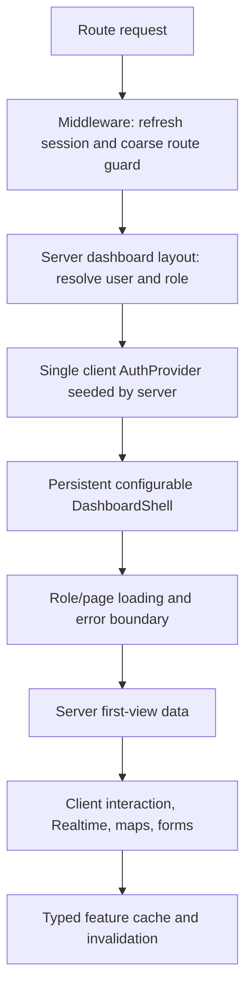

# DriveDrop Website Professional UI/UX Audit

**Scope:** Next.js website only (`website/`). Mobile and backend implementation are excluded.
**Audit basis:** Static review of 103 App Router pages, 87 shared React components, dashboard layouts, auth flow, middleware, design tokens, navigation utilities, loading/error handling, and representative public and role-specific workflows.
**Validation status:** Findings marked **Confirmed** are directly evidenced in source. Findings marked **Validate** require manual browser inspection with appropriate authenticated roles and production-like data; the local website and backend environment files are available for that work.

## Executive Decision

The website should not be visually reskinned page by page yet. Its most visible quality problems are produced by four shared causes:

1. Auth and profile state are fetched and owned in multiple places.
2. Route transitions have no App Router loading boundaries and frequently use full reloads.
3. Role dashboards duplicate their shell, navigation, auth gates, and responsive behavior.
4. Pages bypass existing primitives with one-off dimensions, colors, cards, buttons, statuses, and loading states.

Fix those foundations first. Otherwise a visual redesign will preserve the current freezes, stale sessions, inconsistent density, and duplicated maintenance burden under newer styling.

## Audit Inventory

| Surface | Audited count | Primary risk |
|---|---:|---|
| App Router pages | 103 | Repeated client fetch/auth/loading logic |
| Shared React components | 87 | Multiple competing visual patterns |
| Dashboard role shells | 4 | Client, driver, broker, and admin duplication |
| Route loading boundaries | 0 | No immediate transition feedback |
| Global error boundaries | 1 | Generic inline-styled recovery only |
| Alternate page implementations | 3 | Backup/enhanced/new files inside route tree |

Route coverage includes:

- Public and legal: home, contact, services, parking interest, driver registration, privacy, terms, FCRA, account deletion, and maintenance.
- Authentication: login, signup, broker signup, email confirmation, forgot/reset/change password.
- Client: overview, shipments, shipment detail, quote/completion, tracking, messages, payments, vehicles, profile, notifications, and settings.
- Driver: overview, active work, jobs, applications, invitations, broker loads, navigation, route planning, verification, completion, tracking, messages, earnings, documents, and profile.
- Broker: overview, shipments, create/edit/detail/bulk upload, assignments, load board, carriers, tracking, messages, payouts, documents, profile, and settings.
- Admin: overview, users, applications, drivers, brokers, shipments, assignments, carriers, maps, pricing, campaigns, analytics, leads, reports, documents, notifications, integrations, settings, communications, BOL, commercial operations, and Benji tools.

Component coverage includes:

- UI primitives: button, input, textarea, select, checkbox, tabs, dialog, card, table, date picker, progress, status, metrics, toast, loading, links, and vehicle selection.
- Global layout: public header/footer, service header, page header, auth hash handling, and notifications.
- Public sections: hero, operational overview, quote calculator, platform preview, workflow, capacity, lifecycle, market data, pathways, and CTAs.
- Workflow components: shipment form, address lookup, payment, ownership, photos, terms, messaging, onboarding, and phone verification.
- Operational tools: maps, navigation, route optimization, recommendations, campaign tools, carrier tools, analytics, and Benji assistants.

## Severity-Ranked Findings

### P0: Security And Session Correctness

#### 1. Unvalidated post-login redirect

**Status:** Confirmed.
**Evidence:** `website/src/app/login/page.tsx` reads a `redirect` query parameter and sends it to `website/src/app/api/auth/login/route.ts`. The API returns that value unchanged and the client assigns it to `window.location.href`.

**Impact:** An external URL can become the post-authentication destination, creating an open-redirect/phishing path.

**Required change:** Accept relative internal paths only, reject protocol-relative values, and default server-side to the authenticated role dashboard. Apply the same policy to the email confirmation `next` parameter.

**Acceptance:** Automated tests reject absolute, protocol-relative, encoded, and malformed destinations while allowing approved local paths.

#### 2. Auth state has no single owner

**Status:** Confirmed.
**Evidence:** `website/src/middleware.ts` validates the session and queries profile/role; each `useAuth()` caller initializes an independent client state, calls `getSession()`, and fetches the profile again. Dashboard layouts invoke this independently.

**Impact:** Duplicate queries, inconsistent loading gates, stale profile/role state, and flashes or redirects based on whichever request resolves first.

**Required change:** Introduce one website auth provider at the authenticated app boundary. Bootstrap it from server-validated user/profile data and make `useAuth()` consume context only. Middleware remains the coarse route guard; server layouts enforce role access.

**Acceptance:** One profile query or cached server read per initial authenticated request, no independent auth initialization per component, and role changes/logout propagate consistently.

#### 3. Auth event handling is incomplete

**Status:** Confirmed.
**Evidence:** `website/src/hooks/useAuth.tsx` handles `SIGNED_OUT` but does not reconcile all relevant Supabase auth events.

**Impact:** Token refresh, sign-in, user update, password recovery, and multi-tab changes can leave mounted UI stale.

**Required change:** Centralize the subscription in the auth provider; reconcile `SIGNED_IN`, `SIGNED_OUT`, `TOKEN_REFRESHED`, and `USER_UPDATED`; clear cached protected data on identity changes; show an explicit session-expired path.

**Validate:** Cross-tab logout timing and browser back/forward cache behavior in Chromium, Firefox, and WebKit.

### P0: Perceived Freezes And Navigation

#### 4. Profile timeout blocks whole role shells

**Status:** Confirmed.
**Evidence:** `website/src/hooks/useAuth.tsx` races profile retrieval against a hard three-second timeout. Dashboard layouts render full-screen loading UI while the hook initializes.

**Impact:** The exact reported two-to-three-second freeze is built into the shell. A timeout converts ordinary latency into a full-page wait and then an error rather than useful progressive rendering.

**Required change:** Remove the timeout race from rendering. Resolve identity at the server boundary, render the persistent shell immediately, and isolate page data behind local skeletons. Retry only genuinely transient data requests with cancellation and bounded backoff.

**Acceptance:** Navigation chrome appears without waiting for page data; no authenticated transition shows a blank/full-screen spinner; failed profile resolution produces a specific recoverable state.

#### 5. Login deliberately forces a document reload

**Status:** Confirmed.
**Evidence:** Successful login uses `window.location.href`.

**Impact:** The browser rebuilds the entire application, reruns middleware/profile work, discards in-memory state, and creates a visible pause.

**Required change:** After the server sets cookies, validate the returned internal destination and use `router.replace()`, followed by `router.refresh()` only if server components need cookie revalidation.

#### 6. App Router transition boundaries are absent

**Status:** Confirmed.
**Evidence:** There are no `loading.tsx`, `template.tsx`, or `not-found.tsx` files in the app route tree. Only one global `error.tsx` exists.

**Impact:** Clicks receive no immediate route-level acknowledgment; screens swap abruptly after work completes; missing records and role-specific failures fall into generic experiences.

**Required change:** Add lightweight loading and error boundaries at dashboard-role and high-latency detail/map boundaries. Preserve the shell and use skeletons matching final geometry.

**Acceptance:** Every primary navigation click changes visible state within 100 ms; loading layouts do not shift when content resolves; missing shipment/job/carrier IDs render a contextual not-found state.

#### 7. Navigation abstractions conflict

**Status:** Confirmed.
**Evidence:** Native Next links coexist with `optimized-link.tsx`, `lib/navigation.ts`, `window.location`, and direct router calls. The custom optimized link defaults away from normal prefetch behavior. `NavigationProgress` never activates its loading state.

**Impact:** Different links have different latency, history, prefetch, and feedback semantics. The global progress affordance is inert.

**Required change:** Standardize on Next `Link` for destinations and `router.push/replace` for imperative local navigation. Delete or narrow wrappers that do not add measurable value. Drive progress from actual transitions or omit it in favor of route skeletons.

## P1: Professional Product System

#### 8. Dashboard shells are four copies of one product

**Status:** Confirmed.
**Evidence:** Client, driver, broker, and admin layouts repeat logo/header/sidebar/mobile navigation/profile menu/sign-out/auth loading structures with different hardcoded accents.

**Impact:** Fixes diverge by role, responsive behavior drifts, and the product reads as separate templates rather than one platform.

**Required change:** Build a single `DashboardShell` configured by role navigation, permissions, accent token, and optional operational controls. Keep role differences in configuration and content, not duplicated structure.

**Special defect:** The driver shell's online switch is local component state and does not represent persisted availability. It must either execute and confirm the real availability mutation or be labeled/removed until it does.

#### 9. Visual semantics depend on arbitrary colors

**Status:** Confirmed.
**Evidence:** Source contains hundreds of direct blue, teal, amber, green, red, orange, purple, and hex color uses. Status actions on broker shipment detail use a different vivid color for nearly every state.

**Impact:** Color communicates role, action, status, decoration, and emphasis interchangeably. The result feels generated, is harder to scan, and is vulnerable to contrast and dark-mode drift.

**Required change:** Establish semantic tokens:

| Token family | Use |
|---|---|
| `surface`, `surface-subtle`, `border` | Structure |
| `text`, `text-muted`, `text-subtle` | Hierarchy |
| `action`, `action-hover`, `focus` | Interactive brand action |
| `success`, `warning`, `danger`, `info`, `neutral` | Meaning only |
| Role accent | Small navigational cue, never the whole page palette |

Use one primary action per region. Status changes should use a select/menu plus confirmation where consequential, not a vertical rainbow of full-width buttons.

#### 10. Components do not control density

**Status:** Confirmed.
**Evidence:** The button primitive has reasonable sizing, but pages override width, height, padding, radius, font size, and colors. At least 82 oversized/full-width button overrides occur across 52 files. Raw `<button>` implementations remain common.

**Impact:** Forms feel oversized, table actions become visually dominant, and every page invents its own control geometry.

**Required change:** Make compact product defaults enforceable:

- Control height: 36 px default, 32 px dense, 40 px only for primary mobile/form submission.
- Icon button: stable 32 or 36 px square with tooltip and accessible name.
- Page title: 24-28 px desktop, 22-24 px mobile; panel title: 16-18 px.
- Page spacing: 24 px desktop, 16 px compact/mobile; panel padding: 16-20 px.
- Radius: 6-8 px for controls/cards; pills only for statuses, tags, and toggles.
- Full-width actions: reserved for narrow forms and mobile, not desktop sidebars or card stacks by default.

Add variants for `status`, `toolbar`, `danger`, and `icon`; migrate raw controls to primitives; prohibit arbitrary color/size overrides through review and lint conventions.

#### 11. Card composition is overused

**Status:** Confirmed.
**Evidence:** Dashboard pages frequently wrap section, metric, filter, row, and empty state content in separate bordered/rounded containers. Public/auth pages retain glass, gradient-mesh, glow, large rounded panels, and decorative blur patterns alongside newer enterprise utilities.

**Impact:** Every element asks for equal attention, information density drops, and the visual language resembles generated SaaS templates.

**Required change:** Use unframed page sections, dividers, tables, and aligned columns for structure. Reserve cards for repeated entities, modals, or truly bounded tools. Remove nested cards, decorative glass/glows/orbs, gratuitous gradients, and hover scaling from operational screens.

#### 12. Typography and content hierarchy drift by page

**Status:** Confirmed.
**Evidence:** Auth/public states use hero-scale titles and very large success icons while dashboards mix compact 10-12 px controls with large banners and cards. Similar actions have different labels and prominence across roles.

**Impact:** Operational tasks feel promotional; dense pages become harder to scan; critical and secondary actions compete.

**Required change:** Define role-neutral page templates: list, detail, form/wizard, dashboard, map/operations, and settings. Each template gets one title row, one optional context line, one primary action area, and a consistent content grid.

## P1: Data And Runtime Behavior

#### 13. Client-side fetching dominates route rendering

**Status:** Confirmed pattern; per-page cost requires measurement.
**Evidence:** Authenticated pages commonly mount as client components, wait for auth, then query Supabase in effects. Admin overview launches multiple metrics queries after mount.

**Impact:** Network waterfalls, duplicated profile checks, layout shifts, and no server-rendered first view.

**Required change:** Fetch identity and first-view data in server layouts/pages where practical. Keep browser queries for live interaction. Introduce one caching policy for repeated dashboard resources; do not add a cache library until query ownership and invalidation rules are explicit.

#### 14. Polling, Realtime, and map initialization are inconsistent

**Status:** Confirmed.
**Evidence:** Multiple pages use 30-second polling or short intervals; map pages poll for script readiness; messaging implementations duplicate scroll and subscription patterns; Google Maps is loaded globally before interactive.

**Impact:** Hidden tabs can continue work, duplicate subscriptions can accumulate, and every route pays for maps whether it needs them or not.

**Required change:** Load Google Maps only within map/address boundaries. Use a shared script loader. Pause polling when hidden, prefer Realtime where correctness warrants it, and standardize subscription cleanup/reconnect/error states.

**Validate:** Network request counts after ten minutes, route-change subscription cleanup, map bundle impact, and reconnect behavior after offline/online transitions.

#### 15. Success flows contain artificial delays

**Status:** Confirmed.
**Evidence:** Email confirmation waits two seconds after success; several save/create/update pages wait 1.5-3 seconds before navigation or clear feedback on timers.

**Impact:** Correct operations feel slow and unreliable.

**Required change:** Navigate immediately after durable success. Keep confirmation visible through a toast or destination-page banner. Timers should dismiss nonessential messages, never gate progression.

#### 16. Failure recovery is too generic

**Status:** Confirmed.
**Evidence:** The only route error UI is a global inline-styled page. There is no shared contextual empty/error/retry primitive and no route not-found boundary.

**Impact:** Users cannot distinguish no data, permission denied, expired session, disconnected network, missing record, or server failure.

**Required change:** Define explicit states for `empty`, `loading`, `offline`, `forbidden`, `not-found`, `session-expired`, and `retryable-error`. Keep entered form data when retries are safe.

## Manual Runtime Validation

**Environment:** Local Next.js development server using `website/.env.local`; maintenance mode enabled. Inspection was manual in the integrated Chromium browser at 1440 x 900 and 390 x 844. No E2E suite was executed.

### Confirmed Runtime Findings

1. **Maintenance rewrite is functional when the server listens on `localhost`.** An audit server bound only to `127.0.0.1` returned HTTP 500 because middleware rewrote through `localhost`, which resolved to IPv6 `::1`. This is a local launch mismatch, not evidence of a production failure.
2. **Maintenance mobile presentation is unreadably scaled.** At 390 x 844 the full content fits without horizontal overflow, but the logo, status, explanation, and contact text shrink to very small visual sizes instead of using a legible mobile composition.
3. **Contact identity is inconsistent.** The maintenance page displays `support@drivedrop.com`; the public footer displays `infos@drivedrop.us.com`. Confirm the canonical support address and domain.
4. **The homepage has no application console errors in the inspected state.** Aborted Google Analytics/Ads requests were browser/audit-environment noise, not application failures.
5. **Homepage density and obstruction match the static audit.** Desktop and mobile first views use undersized typography and controls. The commercial-parking floater obscures role cards and operational content on both inspected viewports.
6. **Responsive width is technically contained.** The homepage produced no horizontal overflow at 390 px. Its mobile issue is hierarchy, density, and overlay collision rather than a page-width break.
7. **Unauthenticated role protection redirects correctly.** `/dashboard/client` resolves to `/login?redirect=%2Fdashboard%2Fclient`. On the first cold local request this took approximately 2.3 seconds, including route compilation; production timing remains to be measured.
8. **The login page can become blank after hydration in local development.** The server returns complete login HTML, then the browser repeatedly throws from the `tabs.tsx` bundle, reports root hydration replacement, and leaves a blank surface. This reproduced in a new tab during the same dev-server session.
9. **Unused preload warnings occur.** The login route warns that the primary logo image is preloaded but unused, and Google Tag Manager can also be preloaded without prompt use.

### Runtime Hypothesis To Validate

The leading cause of the local blank login is stale or incompatible development chunks: `next.config.js` creates stable custom vendor chunks, including `radix`, while headers mark all `/_next/static` assets immutable for one year in every environment. A dev-server restart can therefore pair a cached vendor chunk with a new webpack runtime. Confirm in a clean browser profile and production build before classifying production impact. Development assets should not receive production immutable caching.

### Remaining Authenticated Validation

The environment declares service configuration and a client audit account, but no authenticated browser session was established during this manual pass. Credentials will not be extracted or routed through chat. Driver, broker, and admin audit-account availability remains unverified. After signing in directly in the browser with an appropriate account, validate shell timing, stale-session behavior, back/forward navigation, role enforcement, Realtime cleanup, map loading, and the role-specific responsive workflows listed in this document.

## P1: Accessibility And Responsive Quality

#### 17. Accessibility is not governed centrally

**Status:** Validate broadly; confirmed risk from raw controls and color-heavy states.
**Risk areas:** Icon-only controls, raw modal/flyout implementations, status conveyed by color, map-only information, focus visibility under custom colors, form error association, and mobile menu focus management.

**Required standard:** WCAG 2.2 AA; keyboard-complete primary workflows; visible focus; semantic headings; labelled controls; live regions for async results; non-color status labels; 44 px touch targets where controls are isolated on touch screens.

#### 18. Responsive code is local rather than template-driven

**Status:** Confirmed pattern.
**Evidence:** Repeated `w-full`, viewport-height auth gates, role-specific mobile nav, custom card grids, and bespoke table/card transformations appear across route files.

**Impact:** Fixing one viewport or role does not fix equivalent screens elsewhere. Text, controls, and actions can resize or reorder unpredictably.

**Required change:** Define responsive behavior at the page-template and shared-shell level. Tables need intentional compact columns, horizontal overflow, or a designed row-detail pattern; they should not automatically become stacks of oversized cards.

## Route-Family Redesign

| Family | Professional target | Priority |
|---|---|---:|
| Auth | Compact centered form, role choice without decorative tab overload, immediate redirects, explicit recovery | P0 |
| Public home | Operational trust and quote workflow first; reduce generic feature-card marketing and AI decoration | P2 |
| Services | One service template with real service imagery, consistent quote form, pricing disclosure, and payment handoff | P2 |
| Client | Clear shipment lifecycle, next action, concise tracking/payment state, reusable shipment detail | P1 |
| Driver | Dispatch-first workspace, persisted availability, current stop/action hierarchy, offline-safe operational states | P1 |
| Broker | Dense shipment/carrier operations, tables and filters, restrained status semantics, bulk action clarity | P1 |
| Admin | High-density operations console, saved filters, exception queues, auditable actions, configurable dashboards | P1 |
| Maps | Full-bleed working canvas with restrained overlay controls and equivalent list/detail access | P1 |
| Settings | Shared sections, autosave or explicit save consistently, unsaved-change protection, security separation | P2 |
| Legal | Quiet readable document template with stable navigation and no decorative product UI | P3 |

## Component Disposition

### Keep And Strengthen

- Radix-backed dialog, select, tabs, checkbox, and label primitives.
- CVA button primitive, after adding enforced product variants and removing page color overrides.
- `DataTable`, `StatusBadge`, `MetricStrip`, and `PageHeader` as the starting shared product language.
- Domain-specific map, payment, shipment, and route tools after shell/data ownership is corrected.

### Consolidate

- Four dashboard layouts into one configurable shell.
- Client/driver/broker message list and conversation pages into one role-aware messaging feature.
- Notification bells into one shared notification surface with role adapters.
- Address autocomplete implementations behind one loader and field contract.
- Loading, empty, error, and confirmation feedback into common primitives.
- Repeated status maps into a typed status registry shared by badges, filters, timelines, and actions.
- Public service pages into one data-driven template where workflow differences permit.

### Remove Or Quarantine

- `page_backup.tsx`, `page_enhanced.tsx`, and `page-new.tsx` from the route source tree after selecting the canonical implementation.
- Inert `NavigationProgress` unless connected to real navigation state.
- Competing optimized-link/navigation wrappers that bypass standard Next behavior.
- Deprecated glass, mesh, glow, blur-orb, hover-lift, and decorative gradient utilities from product screens.
- Test-only `/test-ai` from production navigation/build exposure.

## Target Frontend Architecture

Ownership rules:

- Middleware: session refresh and coarse unauthorized redirects only.
- Server role layout: authoritative profile/role enforcement and initial auth payload.
- Auth provider: browser auth events and identity transitions, not initial duplicate fetching.
- Feature module: data query, mutation, cache invalidation, status mapping, and UI states.
- Page: composition and route-specific decisions, not primitive styling or auth plumbing.

## Implementation Sequence

### Phase 0: Measure And Protect (2-3 days)

1. Add route timing, query count, Web Vitals, and auth-transition instrumentation without logging tokens or personal data.
2. Capture authenticated desktop/mobile baselines for each role and one public conversion flow.
3. Add smoke tests for login redirects, logout, role guard, back/forward, expired session, and primary role navigation.

**Gate:** Baselines exist for time to shell, time to useful content, request count, layout shift, and route error rate.

### Phase 1: Auth And Navigation Foundation (1-2 weeks)

1. Close redirect validation defects.
2. Add server dashboard role layouts and one auth provider.
3. Remove per-caller auth/profile initialization and full-screen auth gates.
4. Standardize internal navigation and remove artificial success delays.
5. Add role-level loading/error/not-found boundaries.

**Gate:** Shell feedback under 100 ms, no external post-auth redirect, one auth owner, reliable cross-tab logout, and no full-page reload in ordinary authenticated navigation.

### Phase 2: Product Shell And Tokens (1-2 weeks)

1. Build the shared dashboard shell and role navigation configuration.
2. Lock semantic color, typography, spacing, radius, elevation, and control-density tokens.
3. Standardize page header, toolbar, filters, status, metric, table, empty, error, and skeleton primitives.
4. Remove deprecated decorative utilities from authenticated product UI.

**Gate:** All four roles use one shell; no new arbitrary visual values; each common state has one shared implementation.

### Phase 3: Highest-Value Workflows (2-4 weeks)

Implement vertical slices in this order:

1. Client quote/new shipment through payment and shipment detail.
2. Driver availability, jobs, active route, pickup verification, and delivery completion.
3. Broker shipments, carrier assignment, tracking, and payouts.
4. Admin shipment exceptions, assignment, users/applications, pricing, and communications.

For each slice, move first-view data server-side where practical, add local skeleton/error/empty states, migrate controls to primitives, and add Playwright coverage before proceeding.

### Phase 4: Public And Secondary Surfaces (1-2 weeks)

1. Consolidate public service and legal templates.
2. Replace decorative/AI-generic sections with concrete operational proof and real product/service media.
3. Normalize settings, notifications, onboarding, campaign, analytics, and Benji surfaces.
4. Remove alternate/backup route files and dead utilities.

## Definition Of Done

### Performance

- Persistent shell response to navigation: under 100 ms perceived feedback.
- LCP: under 2.5 seconds at p75 on target mobile and desktop traffic.
- INP: under 200 ms at p75.
- CLS: under 0.1.
- No global Google Maps cost on routes that do not use maps or address lookup.
- No duplicate profile request during a normal dashboard entry.

### Reliability And Security

- Internal-only redirect policy covered by unit and E2E tests.
- Role access enforced server-side for client, driver, broker, and admin.
- Logout, expiry, refresh, role change, multi-tab, back/forward, offline, and reconnect have defined behavior.
- Realtime subscriptions and polling are cleaned up on navigation and paused when appropriate.

### UI And Accessibility

- WCAG 2.2 AA on primary workflows.
- One shared shell and one primitive set across roles.
- No nested cards, decorative orbs/glass, arbitrary status colors, or promotional-scale headings in dashboards.
- Every async route and feature has stable loading, empty, error, and success treatment.
- Desktop tables remain efficient; mobile transformations preserve comparison and action clarity.

### Testing

- Playwright: login/logout, each role landing page, quote-to-checkout, driver active workflow, broker shipment workflow, and admin assignment workflow.
- Vitest/RTL: redirect sanitizer, auth reducer/provider, status registry, shared shell navigation, and async state primitives.
- Automated accessibility checks plus manual keyboard and screen-reader verification of critical flows.
- Screenshot regression set for public, auth, and representative role templates at desktop and mobile widths.

## Immediate Backlog

| Order | Work item | Outcome |
|---:|---|---|
| 1 | Add and test internal redirect sanitizer | Close auth redirect vulnerability |
| 2 | Create server-seeded shared auth provider | Eliminate duplicate/stale auth ownership |
| 3 | Create role dashboard loading/error boundaries | Remove blank and abrupt transitions |
| 4 | Replace login hard reload with validated soft navigation | Reduce login delay |
| 5 | Build shared dashboard shell | Stop role layout drift |
| 6 | Persist or remove driver online toggle | Make operational state truthful |
| 7 | Establish semantic tokens and density rules | End arbitrary styling |
| 8 | Consolidate status/loading/empty/error components | Make state communication consistent |
| 9 | Lazy-load maps and audit intervals/subscriptions | Reduce global work and leaks |
| 10 | Redesign quote-to-checkout vertical slice | Prove the architecture on revenue flow |

## Final Recommendation

Treat this as a controlled frontend migration, not a rewrite. Keep domain tools that already work, replace shared ownership and presentation underneath them, and ship one measured workflow at a time. The professional result will come primarily from speed, truthful state, density, consistency, and predictable interaction; palette changes are secondary.